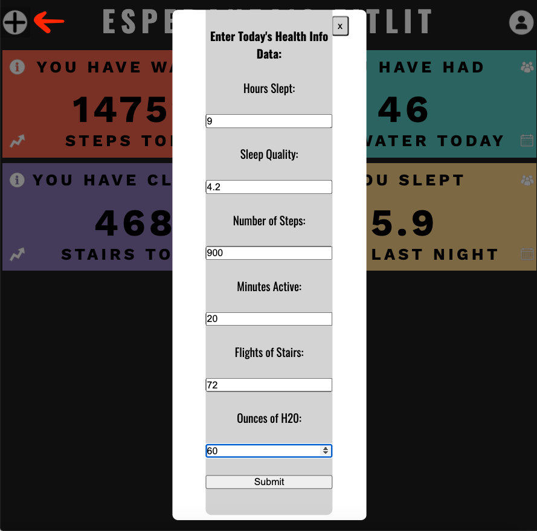

# Refactor Tractor Group Project: FitLit
## Authors
[Aaron Townshend](https://github.com/atownse) 
[Elle Li](https://github.com/Elle624) 
[Lola Dolinsky](https://github.com/lo-la-do-li)

## Abstract
**FitLit Description:** FitLit is a project that simulates an activity tracker, allowing a given user to see their health statistics.  Statistics include steps taken, water consumed, quality and quantity of sleep, and stairs climbed.  To make it even more dynamic, the user can see other users' stats, both the friends that are linked to their profile and averages of all users in the database.

Part of this project was also designing a UI/UX comp.  We used Canva to make a mock-up and used that for wireframming and writing/implementing our CSS.

Technically, this project incorporated designing the architecture of the project, which included multiple classes to handle various small databases.  Code implementation focused on using information from various databases in the same classes and how those can talk to each other.

**Refactor Tractor Description:** The goal for this project was to refactor the existing code from a previously completed project to be more efficient.

In the JavaScript files, we refactored many functions in scripts.js and methods on each Class using array iterator methods. We created a parent class "Action" and called each of our pre-existing "Activity", "Hydration", and "Sleep" classes a child of the parent, which inherits its properties and methods.

After refactoring the JS, we were tasked with replacing local datasets to endpoints linked to an API.

Additionally, we cleaned up our stylesheet using SASS and created partial files. HTML was modified to include aria tags, and styling utilizes contrasting colors to ensure that our site meets accessibility standards.

In order to make sure our DOM updates were called on, we used spy testing in our chai library.

---
## Learning Goals
+ Build on top of pre-existing code that you did not write and navigate someone else’s codebase
+ Develop processes for working remotely and submitting pull requests to perform effective code reviews that help ensure the code is accurate and that everyone understands it
+ Make network requests to API endpoints to retrieve and manipulate data
+ Refactor pre-existing code and use inheritance to DRY up repetitive logic
+ Ensure your app is following best practices for accessibility
+ Leverage Sass to DRY up your CSS
+ Incorporate Webpack to streamline your workflow process
+ Leverage Chai Spies to verify that your DOM manipulation is happening
---
[Visit our deployed site here](https://elle624.github.io/FitLit-Refactor/) or set it up on your local device by following the instructions below

## Setup
+ Clone down this repo to your local computer.
+ CD into the project directory.
+ In your terminal, run `npm install` and then `npm start`
+ You will see a bunch of lines output to your terminal. One of those lines will be something like: `Project is running at http://localhost:8080/`
+ Go to http://localhost:8080/ in your browser to view the site.
---

## FitLit in Action

### Home Screen
The user will see this as their main view when they load the page.

### More Information
The user can click on the buttons on the card to get more information, both about their own stats and stats aggregated from all users.

### User Information
The user can also click on the profile icon in the upper right hand corner to see some additional profile information and stats from their friends.

### Added Functionality: User Input Form
The user can click an "add" button located in the top left corner of the site, to input today's health info to be applied to their FitLit.

---
## Technologies:
+ JavaScript ES6
+ Webpack
+ Chai Spies
+ Sass/SCSS

## Project Management Tools and Practices:
+ Git Version Control
+ GitHub Project Board
+ Pull Request Template
+ Test-Driven Development (TDD)
